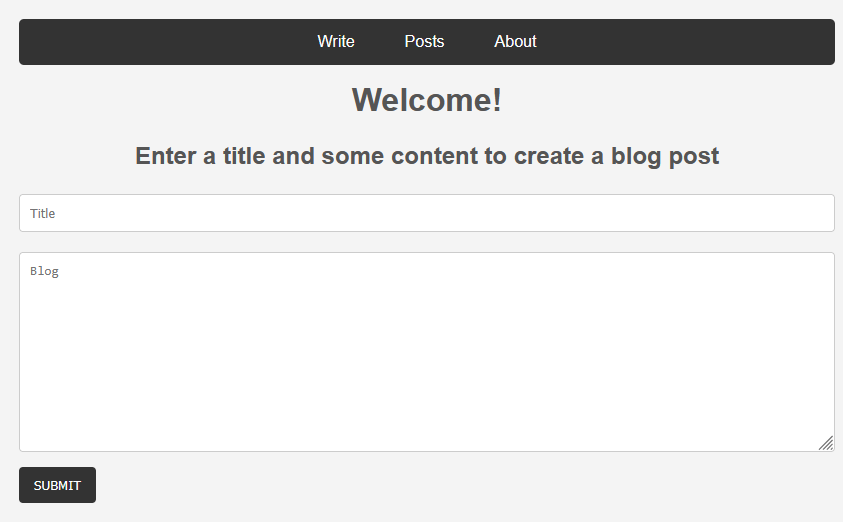

# backend_blog
This is a demo project that I created to practice my Node.js, Express, and EJS skills. It only runs locally at the moment so you will need to download all files and run the index.js file using Node.js. The file runs on port 3000 by default.

## How to Run:
1. Navigate to the repository containing all files that you have downloaded.
2. Install appropriate node modules using the "npm i" command.
3. Enter command "node index.js". The message "Listening on port 3000." should print to the terminal.
4. Open your preferred browser and navigate to "localhost:3000". This should be the landing page for the blog.

Thank you for checking out my project!